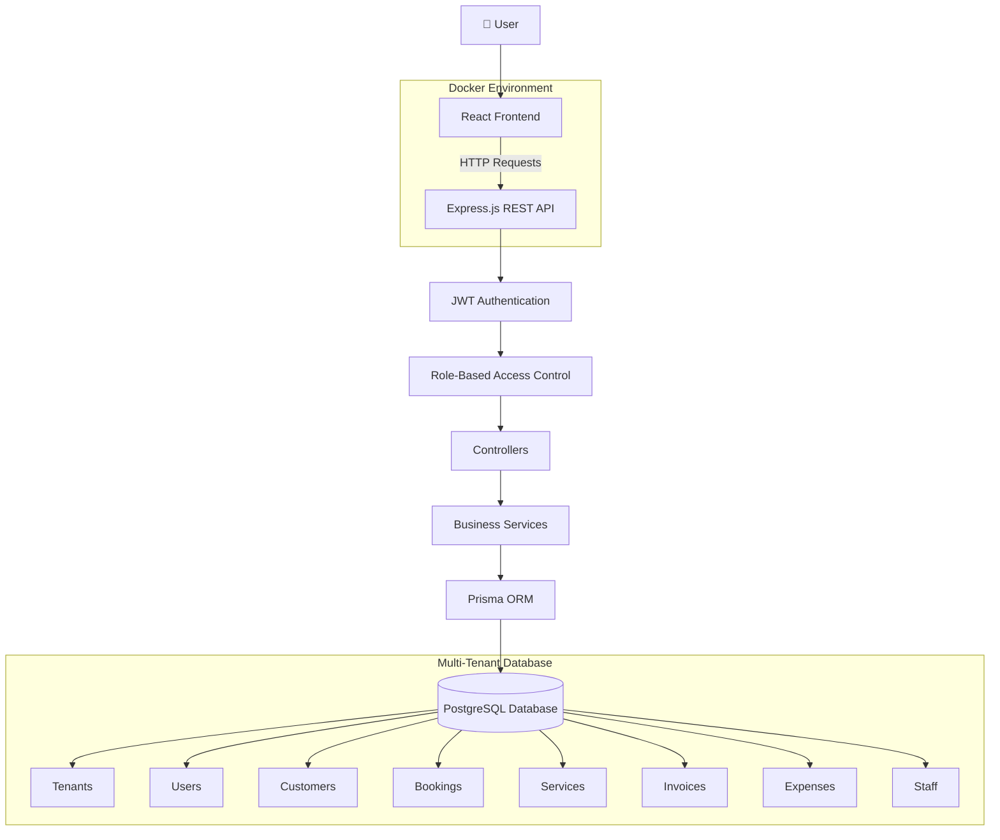

<div align="center">
  
━━━━━━━━━━━━━━━━━━━━━━━━━━━━━━━━━━━━━━━━━━━

      BUSINESS MANAGEMENT SAAS PLATFORM

 Secure • Multi-Tenant • Dockerized • Full Stack

━━━━━━━━━━━━━━━━━━━━━━━━━━━━━━━━━━━━━━━━━━━

🚀 Business Management SaaS Platform

A full-stack multi-tenant business management solution built with React, Express, PostgreSQL, Prisma ORM, and Docker.


</div>

📖 About

Business Management SaaS Platform is a multi-tenant web application that enables businesses to manage customers, bookings, services, staff, invoices, and expenses from a single platform.

The project follows a modular backend architecture with secure JWT authentication, role-based access control, and tenant-level data isolation. It was built to demonstrate real-world backend architecture, database design, and full-stack development practices.

📸 Application Preview

# Login


# Dashboard


# Customer Management


# Booking Management


# Financial Dashboard


✨ Features

- 🔐 JWT Authentication & Role-Based Access Control
- 🏢 Multi-Tenant Architecture
- 👥 Customer Management
- 📅 Booking Management
- 💼 Staff Management
- 💳 Invoice Management
- 💰 Expense Tracking
- 🛠 Service Management
- 📊 Business Dashboard
- 🐳 Dockerized Deployment

🏗 Architecture


🛠 Tech Stack

| Category | Technologies |
|-----------|--------------|
| Frontend | React.js, Axios, CSS |
| Backend | Node.js, Express.js |
| Database | PostgreSQL, Prisma ORM |
| Authentication | JWT, bcrypt |
| DevOps | Docker, Docker Compose |

📂 Project Structure
Business-Management-SaaS
│
├── backend/
├── frontend/
├── docker-compose.yml
└── README.md

 ⚙ Getting Started

# Clone Repository
```bash
git clone https://github.com/Kushagrahms/Multi-tenant-Saas-platform.git
```
# Install Dependencies

```bash
# Backend
cd backend
npm install

# Frontend
cd ../frontend
npm install
```
# Start the Application

```bash
# Backend
cd backend
npm run dev
```

```bash
# Frontend
cd frontend
npm run dev
```
# Docker

```bash
docker compose up --build
```
📌 Future Improvements

- Kubernetes Deployment
- Swagger API Documentation
- Email Notifications
- Reports & Analytics
- CI/CD Pipeline
  
👨‍💻 Author

**Kushagra Shrivastava**

If you found this project interesting, feel free to ⭐ the repository.
